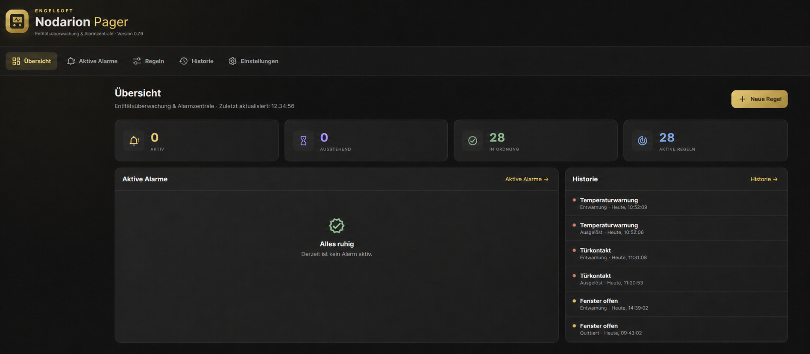
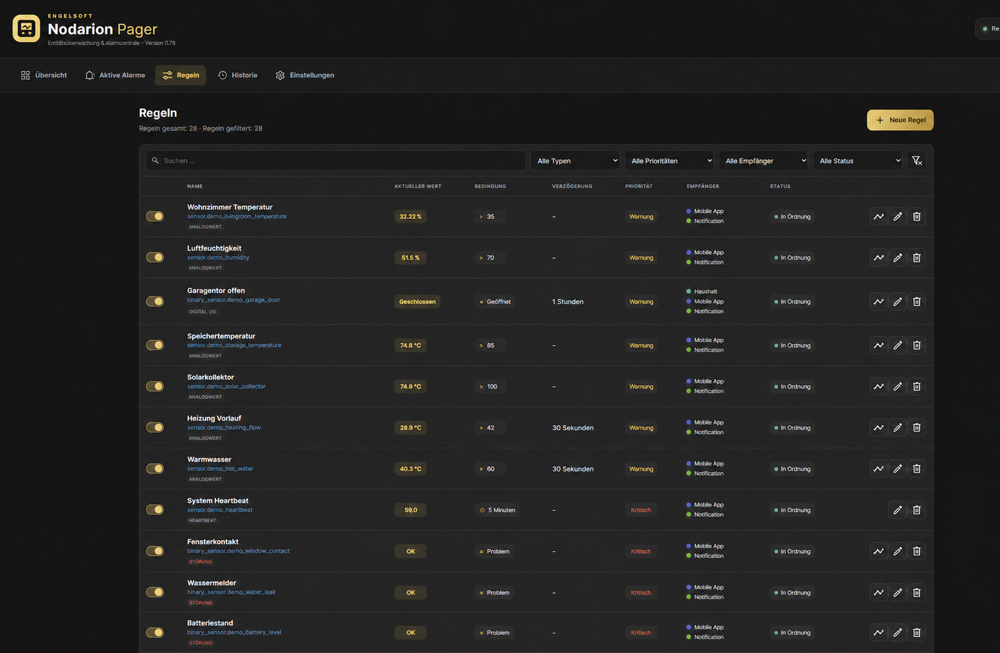

# Nodarion Alert Manager for Home Assistant

  

  **Turn entity states into clear, actionable and acknowledgeable alerts.** 
  **Aus Entitätszuständen werden verständliche, quittierbare Alarme.**

  
  
  
  
  
  
  

  [English](#english) · [Deutsch](#deutsch)

---

## English

Nodarion Alert Manager is a fully local monitoring and alert center for Home Assistant. It watches any entity, evaluates configurable rules and turns raw states into clear alarms with delays, acknowledgement, escalation, schedules, history and notification routing.

### Nodarion at a glance

The dashboard brings alert health, active rules and recent history together in one calm, focused view.

Rules can be searched, filtered, paused, edited and checked against their current state at a glance.

### Why Nodarion?

- **One central alert view:** see active, pending and acknowledged alerts at a glance
- **Guided rule wizard:** select an entity, define the condition, configure alerting and confirm the live summary
- **Flexible rules:** thresholds, digital/I/O states, faults and heartbeats
- **Fewer false alarms:** delays, hysteresis, cooldown and configurable `unknown`/`unavailable` handling
- **Targeted notifications:** recipients and severity per rule, repetitions and escalation stages
- **Operations ready:** maintenance mode, rule pauses, automatic or manual reset and schedules
- **Traceable:** alert history, comments, diagnostics and Recorder-based charts
- **Privacy friendly:** processing and storage stay inside Home Assistant
- **Bilingual and responsive:** German and English UI for desktop and mobile

### Install with HACS

1. Open HACS and select **Integrations**.
2. Open the menu in the top-right corner and choose **Custom repositories**.
3. Add `https://github.com/engelsofta/nodarion-alert-manager` as an **Integration** repository.
4. Install **Nodarion Alert Manager** and restart Home Assistant.
5. Open **Settings → Devices & services → Add integration**.
6. Search for **Engelsoft Nodarion Pager** and finish setup.
7. Open **Nodarion Pager** from the sidebar and create your first rule.

### Manual installation

1. Download [`nodarion-alert-manager.zip`](https://github.com/engelsofta/nodarion-alert-manager/releases/latest/download/nodarion-alert-manager.zip) from the latest release.
2. Extract its contents into `/config/custom_components/nodarion_pager/`.
3. Restart Home Assistant and add the integration from **Devices & services**.

Minimum supported version: **Home Assistant 2026.1.0**.

### Rule types

| Type | Purpose |
| --- | --- |
| **Threshold** | Numeric values using `=`, `≠`, `>`, `<`, `≥`, `≤`, between or outside |
| **Digital / I/O** | States such as `on`, `off`, `open`, `closed`, `1` or `0` |
| **Fault** | A state rule with a visible Home Assistant fault notification |
| **Heartbeat** | Alert when an entity stops changing within a configured time window |

### Example

Monitor `sensor.boiler_temperature` with **greater than 70 for 20 seconds**. Short spikes are ignored; only a sustained high value creates an alert. Add hysteresis, a schedule and escalation for dependable operational monitoring.

### Notifications

Nodarion discovers modern `notify` entities and available `notify.*` services. Recipients, severity, repetition and escalation can be configured per rule. Resolved notifications can be enabled separately.

### Home Assistant events

| Event | Meaning |
| --- | --- |
| `nodarion_pager_alert` | A rule triggered or repeated |
| `nodarion_pager_resolved` | An alert was reset |
| `nodarion_pager_acknowledged` | An alert was acknowledged |

### Privacy

Rule evaluation, history and configuration remain inside your Home Assistant instance. Nodarion has no cloud connection, tracking or telemetry. Data only leaves Home Assistant when you explicitly configure an external notification service as a recipient.

---

## Deutsch

Nodarion Alert Manager ist eine vollständig lokal arbeitende Alarmzentrale für Home Assistant. Die Integration überwacht beliebige Entitäten, bewertet deren Zustände anhand frei konfigurierbarer Regeln und macht aus technischen Messwerten übersichtliche Alarme – inklusive Verzögerung, Quittierung, Eskalation, Zeitplan, Historie und Weiterleitung.

### Ein Blick auf Nodarion

Die Übersicht bündelt Alarmstatus, aktive Regeln und Historie in einer ruhigen, klaren Oberfläche.

Regeln lassen sich durchsuchen, filtern, pausieren, bearbeiten und direkt auf ihren aktuellen Zustand prüfen.

### Warum Nodarion?

- **Eine zentrale Alarmansicht:** aktive, ausstehende und quittierte Meldungen auf einen Blick
- **Einfacher Regel-Wizard:** Entität auswählen, Bedingung festlegen, Alarmierung konfigurieren und Zusammenfassung bestätigen
- **Flexible Regeln:** Grenzwerte, Digital-/I/O-Zustände, Störungen und Heartbeats
- **Weniger Fehlalarme:** Verzögerung, Hysterese, Cooldown und Verhalten bei `unknown`/`unavailable`
- **Gezielte Alarmierung:** Empfänger und Prioritäten pro Regel, Wiederholungen und Eskalationsstufen
- **Betriebsgerecht:** Wartungsmodus, Regelpausen, automatische oder manuelle Rücksetzung und Zeitpläne
- **Nachvollziehbar:** Alarmhistorie, Kommentare, Diagnoseinformationen und Recorder-Diagramme
- **Datenschutzfreundlich:** Verarbeitung und Speicherung erfolgen lokal in Home Assistant
- **Zweisprachig und responsiv:** deutsche und englische Oberfläche für Desktop und Mobilgeräte

### Installation über HACS

1. Öffne HACS und wähle **Integrationen**.
2. Öffne das Menü oben rechts und wähle **Benutzerdefinierte Repositories**.
3. Füge `https://github.com/engelsofta/nodarion-alert-manager` als Kategorie **Integration** hinzu.
4. Installiere **Nodarion Alert Manager** und starte Home Assistant neu.
5. Öffne **Einstellungen → Geräte & Dienste → Integration hinzufügen**.
6. Suche nach **Engelsoft Nodarion Pager** und schließe die Einrichtung ab.
7. Öffne **Nodarion Pager** in der Seitenleiste und erstelle deine erste Regel.

### Manuelle Installation

1. Lade [`nodarion-alert-manager.zip`](https://github.com/engelsofta/nodarion-alert-manager/releases/latest/download/nodarion-alert-manager.zip) aus dem aktuellen Release.
2. Entpacke den Inhalt nach `/config/custom_components/nodarion_pager/`.
3. Starte Home Assistant neu und füge die Integration über **Geräte & Dienste** hinzu.

Mindestens **Home Assistant 2026.1.0** wird benötigt.

### Regeltypen

| Typ | Einsatz |
| --- | --- |
| **Grenzwert** | Numerische Werte mit `=`, `≠`, `>`, `<`, `≥`, `≤`, innerhalb oder außerhalb eines Bereichs |
| **Digital / I/O** | Zustände wie `on`, `off`, `open`, `closed`, `1` oder `0` |
| **Störung** | Zustandsregel mit sichtbarer Home-Assistant-Störungsmeldung |
| **Heartbeat** | Alarm, wenn sich eine Entität innerhalb eines Zeitfensters nicht mehr ändert |

### Beispiel

Überwache `sensor.boiler_temperature` mit der Bedingung **größer als 70 für 20 Sekunden**. Kurze Messspitzen werden ignoriert; erst ein dauerhaft zu hoher Wert erzeugt einen Alarm. Mit Hysterese, Zeitplan und Eskalation lässt sich daraus eine belastbare Betriebsüberwachung bauen.

### Benachrichtigungen

Nodarion erkennt moderne `notify`-Entitäten sowie vorhandene `notify.*`-Dienste. Pro Regel können Empfänger, Priorität, Wiederholung und Eskalation festgelegt werden. Entwarnungen lassen sich separat aktivieren.

### Home-Assistant-Ereignisse

| Ereignis | Bedeutung |
| --- | --- |
| `nodarion_pager_alert` | Eine Regel wurde ausgelöst oder wiederholt |
| `nodarion_pager_resolved` | Ein Alarm wurde zurückgesetzt |
| `nodarion_pager_acknowledged` | Ein Alarm wurde quittiert |

### Datenschutz

Die Regelauswertung, Historie und Konfiguration bleiben in deiner Home-Assistant-Instanz. Nodarion besitzt keine Cloud-Anbindung, kein Tracking und keine Telemetrie. Daten verlassen Home Assistant nur dann, wenn du selbst einen externen Benachrichtigungsdienst als Empfänger auswählst.

---

## Support and development

- [Report a bug](https://github.com/engelsofta/nodarion-alert-manager/issues/new?template=bug_report.yml)
- [Request a feature](https://github.com/engelsofta/nodarion-alert-manager/issues/new?template=feature_request.yml)
- [Changelog](CHANGELOG.md)
- [Security policy](SECURITY.md)
- [Contributing](CONTRIBUTING.md)

This is a custom integration and is not affiliated with or endorsed by the Home Assistant project.

## License

Apache License 2.0 © 2026 Engelsoft
